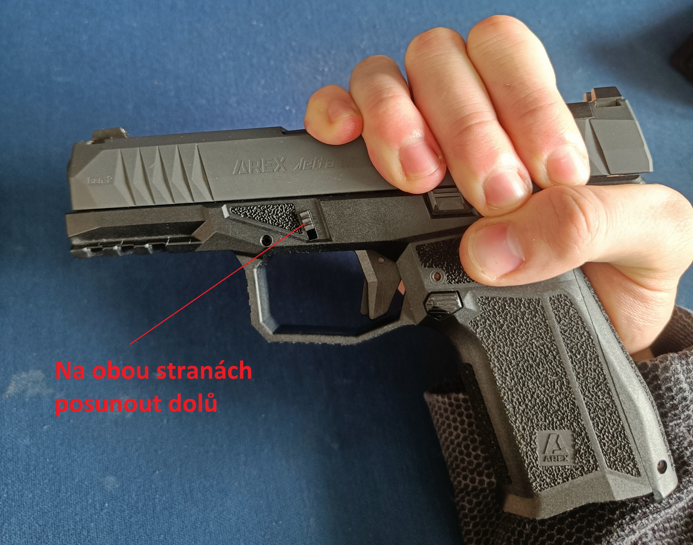
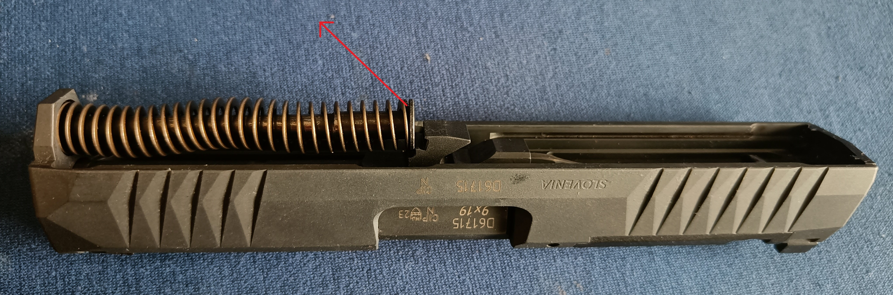

# Rozborka zbraně

Rozborka zbraně je důležitý proces, který umožňuje střelci vyčistit a udržovat všechny její části. Je nezbytné mít důkladnou znalost, jak správně rozebrat zbraň, aby nedošlo k poškození její funkčnosti. Tato kapitola se zaměřuje na krok za krokem postup rozborky pistole AREX Delta M Gen2.

## Příprava na rozborku

Před zahájením rozborky zbraně je nutné zajistit, že je zbraň bezpečná. Ujistěte se, že:

1. **Zbraň je vybita**: Zkontrolujte, zda není v komoře náboj a zda není zásobník vložen.
2. **Zabezpečte pracovní prostor**: Rozborka zbraně by měla probíhat na čistém a dobře osvětleném místě. Ujistěte se, že máte všechny potřebné nástroje, pokud jsou potřeba (např. jemné nástroje pro čištění).
3. **Bezpečnostní opatření**: Zbraň by měla být vždy držena zamířená do bezpečné oblasti, i když je vybita.

## Krok 1: Uvolnění závěru

1. **Zkontrolujte, že je zbraň vybita**: Otevřete závěr a ujistěte se, že je komora prázdná a že není v komoře žádný náboj.
2. **Stiskněte vypouštěcí tlačítko zásobníku**: Vyjměte zásobník a ujistěte se, že zbraň nemá žádné náboje.
3. **Uvolněte závěr**: Závěr se uvolňuje pomocí páčky, která je umístěna na straně zbraně. Tato páčka umožňuje uvolnit závěr a zcela ho oddělit od rámu.

## Krok 2: Demontáž závěru

1. **Vyjmutí závěrového mechanismu**: Posuňte a držte závěr 3-5mm vzad a poté posuňtě páčku pro uvolnění závěru dolů. Následně celý závěr posuňte dopředu a nahoru.
2. **Odstranění pružiny závěru**: Pružinu s nástavcem stlačte o pár mm a vyklopte ze závěru

## Krok 3: Demontáž hlavně

1. **Vyjmutí hlavně**: Po odstranění pružiny a závěrového mechanismu je možné vyjmout hlaveň. Uchopte hlaveň pevně a opatrně ji vytáhněte z rámu.
2. **Kontrola hlavně**: Po vyjmutí hlavně je vhodné ji zkontrolovat na přítomnost nečistot nebo opotřebení. Pokud jsou na hlavni zbytky prášku nebo oleje, je potřeba je odstranit.

## Krok 4: Sestavení zbraně

Sestavení probíhá v opačném pořadí než demontáž:

1. **Vložení hlavně zpět do závěru**.
2. **Nasaďte pružinu proti zpětnému rázu**.
3. **Sestavte závěr zpět na rám**
4. **Několikrát zatáhněte a pusťte závěr pro kontrolu funkčnosti zbraně**

---

[Předchozí stránka](02function.md) |  [Další strnka](04cleaning.md)

[Obsah](README.md)
