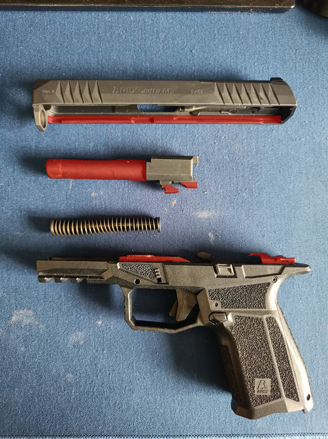

# Postup čištění a promazání zbraně

Čištění a promazání zbraně jsou klíčovými kroky k zajištění její dlouhé životnosti a spolehlivosti. Pokud není zbraň pravidelně čištěna, mohou se v ní hromadit prach, karbon, zbytky prášku a jiné nečistoty, které mohou negativně ovlivnit její funkčnost. Tato kapitola se zaměřuje na správný postup čištění a promazání pistole AREX Delta M Gen2.

## Příprava na čištění

Před zahájením čištění je důležité zajistit, aby byla zbraň bezpečná. Postupujte podle následujících kroků:

1. **Zkontrolujte, že je zbraň vybita**: Zbraň musí být vždy vybita před čištěním. Ujistěte se, že v komoře, zásobníku a hlavni není žádný náboj.
2. **Vyberte si vhodné pracovní místo**: Čištění zbraně by mělo probíhat na čistém a dobře osvětleném místě. Použijte podložku, která ochrání povrch před poškrábáním.
3. **Připravte si potřebné nástroje**:
   - Jemné čisticí kartáče
   - Speciální oleje a maziva na zbraně
   - Hadříky z mikrovlákna
   - Čisticí tyč na hlaveň
   - Ochranné rukavice (volitelné)
4. Proveďte rozborku zbraně 

## Krok 1: Čištění hlavně

Hlaveň je jednou z nejdůležitějších částí zbraně a její pravidelné čištění je nezbytné pro správnou funkčnost a přesnost zbraně. Postupujte takto:

1. **Vložení čisticího kartáče**: Použijte speciální čisticí kartáč na hlaveň, který je kompatibilní s ráží zbraně. Připevněte kartáč na čisticí tyč a jemně ho protahujte hlavní, abyste odstranili zbytky prachu, karbonu a dalších nečistot.
   
2. **Použití čisticího prostředku**: Aplikujte čisticí prostředek na kartáč nebo přímo do hlavně, aby pomohl rozpustit usazené nečistoty. Pohybujte kartáčem směrem k ústí hlavně (od komory k ústí), dokud není hlaveň čistá.

3. **Vyčištění hlavně suchým hadříkem**: Po použití čisticího prostředku vyčistěte hlaveň suchým hadříkem, abyste odstranili zbytky čisticího prostředku.

4. **Ošetření hlavně olejem**: Nakonec aplikujte na hlaveň malé množství speciálního oleje na zbraně. Olej pomůže chránit kov před korozí a zajišťuje hladký pohyb střely.

## Krok 2: Čištění závěru a rámu

Závěr a rám zbraně jsou vystaveny velkému zatížení při každém výstřelu, což znamená, že se na nich hromadí prach, karbon a zbytky prášku. Čistěte je podle následujícího postupu:

1. **Použití čisticího kartáče**: Použijte jemný kartáč, aby se odstranily všechny nečistoty z povrchu závěru a rámu. Nepoužívejte příliš tvrdé kartáče, abyste nepoškodili povrch.

2. **Otření hadříkem z mikrovlákna**: Po vyčištění kartáčem otřete celý závěr a rám hadříkem z mikrovlákna, aby se odstranily jemné prachové částice a zbytky.

3. **Použití čisticího prostředku**: Pokud jsou na závěru nebo rámu silné usazeniny karbonu nebo jiných nečistot, použijte čisticí prostředek na zbraně, který je šetrný k povrchům. Naneste ho na hadřík a jemně otřete všechny znečištěné části.

4. **Ošetření olejem**: Naneste malé množství oleje na pohyblivé části závěru a rámu (na obrázku vyznačené červeně), aby byl zajištěn hladký pohyb. Důležité je přebytečný olej otřít, aby neznečišťoval povrch a neatrakoval prach.

## Krok 3: Kontrola a finální ošetření

Po dokončení čištění je důležité provést finální kontrolu:

1. **Zkontrolujte všechny součásti**: Ujistěte se, že všechny části zbraně jsou správně namontovány a že zbraň neobsahuje žádné zbytky nečistot.

2. **Finální promazání**: Naneste malé množství oleje na všechny pohyblivé části zbraně, zejména na závěr, spoušť a zásobník. Nezapomeňte otřít přebytečný olej.

## Krok 4: Sborka zbraně 

Po vyčištění a promazání zbraň složte a zkontrolujte její funkčnost dvojnásobným natáhnutím a puštěním závěru.

## Závěr

Pravidelné čištění a promazání zbraně AREX Delta M Gen2 je nezbytné pro její dlouhou životnost a spolehlivý výkon. Ujistěte se, že všechny části jsou pečlivě očištěny a promazány, a zbraň bude vždy připravena k použití. Nezapomeňte na důkladnou kontrolu při každém čištění, abyste zajistili, že všechny komponenty jsou v dobrém stavu a funkční.

---

[Předchozí stránka](README.md) |  [Další strnka](02function.md)

[Obsah](README.md)